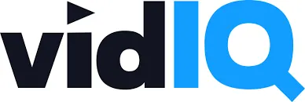
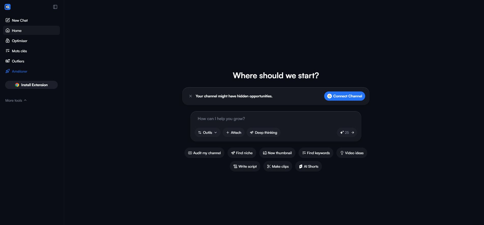
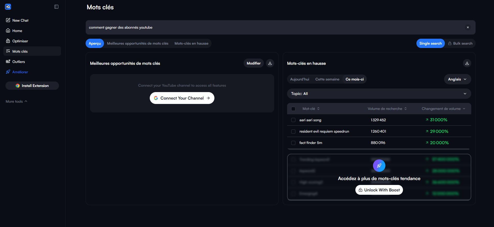
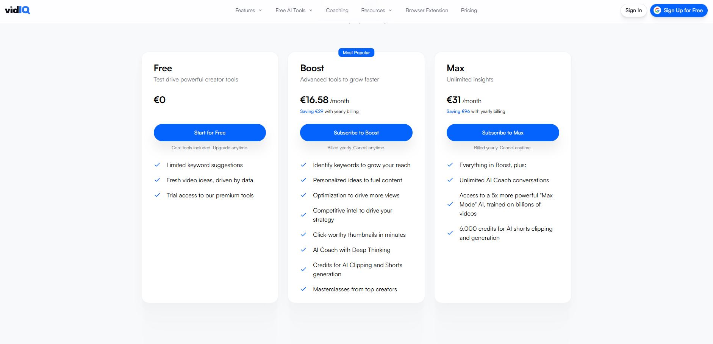

# vidIQ Avis 2026 : Test Complet après 12 Mois d'Utilisation sur YouTube

> **Dernière mise à jour : mars 2026** — Cet avis sur vidIQ repose sur une utilisation quotidienne de l'outil pendant plus d'un an. Fonctionnalités, tarifs, avantages, inconvénients et comparatif avec les alternatives : voici notre verdict honnête.

---

## 📋 Résumé rapide de notre avis sur vidIQ

| Critère | Détail |
|---|---|
| **Note globale** | ⭐ 8,2 / 10 |
| **Idéal pour** | Créateurs YouTube réguliers (1+ vidéo par semaine) |
| **Prix** | Gratuit (limité) — Boost ≈ 16,58 €/mois — Max ≈ 31 €/mois — Coaching ≈ 99 €/mois |
| **Points forts** | Recherche de mots-clés, score SEO vidéo, idées quotidiennes, veille concurrentielle |
| **Points faibles** | Interface uniquement en anglais, tarifs élevés sur les plans premium |
| **Alternatives** | TubeBuddy, Morningfame, YouTube Studio (gratuit) |
| **Essai gratuit** | ✅ Plan gratuit sans limite de durée |

👉 **[Essayer vidIQ gratuitement](https://vidiq.com/stephane)** et jugez par vous-même.

---

## Table des matières

- [Qu'est-ce que vidIQ ?](#quest-ce-que-vidiq-)
- [Les fonctionnalités principales de vidIQ](#les-fonctionnalités-principales-de-vidiq)
- [Avantages de vidIQ](#avantages-de-vidiq--ce-quon-a-aimé)
- [Inconvénients de vidIQ](#inconvénients-de-vidiq--les-limites-constatées)
- [Les tarifs vidIQ en 2026](#les-tarifs-vidiq-en-2026--quel-plan-choisir-)
- [vidIQ vs TubeBuddy : le comparatif](#vidiq-vs-tubebuddy--le-comparatif-2026)
- [À qui vidIQ convient-il ?](#à-qui-vidiq-convient-il-)
- [Conseils pour optimiser sa chaîne avec vidIQ](#conseils-pratiques-pour-optimiser-sa-chaîne-youtube-avec-vidiq)
- [Avis d'utilisateurs](#avis-dutilisateurs--ce-que-disent-les-créateurs)
- [FAQ](#faq--questions-fréquentes-sur-vidiq)
- [Notre verdict final](#verdict-final--notre-avis-sur-vidiq-en-2026)

---

## Qu'est-ce que vidIQ ?

vidIQ est un outil d'optimisation et d'analyse pour YouTube, disponible sous forme d'extension Chrome et d'application web. Fondée en 2012, la plateforme est aujourd'hui un partenaire certifié YouTube utilisé par plus de 15 millions de créateurs dans le monde.

Son objectif principal est d'aider les vidéastes à obtenir davantage de vues, à comprendre l'algorithme YouTube et à accélérer la croissance de leur chaîne grâce à des données exploitables. Concrètement, vidIQ intervient à chaque étape de votre workflow de créateur :

- **Avant la publication** : recherche de mots-clés, analyse des tendances, idées de vidéos quotidiennes.
- **Pendant l'optimisation** : score SEO de chaque vidéo, suggestions de titres, de descriptions et de tags.
- **Après la mise en ligne** : suivi des performances, veille concurrentielle, audit de votre chaîne.

L'outil se distingue par son intégration directe dans l'interface YouTube : une fois l'extension installée, un panneau latéral s'affiche à côté de vos vidéos avec un aperçu complet des métriques clés et des recommandations d'amélioration.

---

## Les fonctionnalités principales de vidIQ

### 🔎 Recherche de mots-clés YouTube

C'est la fonctionnalité phare de vidIQ, et clairement la plus utile au quotidien. L'outil analyse le volume de recherche des mots-clés sur YouTube, attribue un score de compétition et propose des termes associés que vous n'auriez pas trouvés seul.

Pour chaque mot-clé, vidIQ affiche :

- Le volume de recherche mensuel estimé
- Un score de compétition (faible, moyen, élevé)
- Un "Overall Score" qui combine potentiel et difficulté
- Des suggestions de mots-clés connexes et de questions fréquentes

Ce système permet de viser des requêtes réalistes par rapport à la taille de votre chaîne, plutôt que de se battre sur des termes ultra-concurrentiels monopolisés par les grandes chaînes.

### 📊 Score SEO et audit vidéo

Chaque vidéo de votre chaîne reçoit un score SEO vidIQ. Ce score est calculé à partir de plusieurs critères : présence de mots-clés dans le titre, la description et les tags, longueur de la description, qualité de la miniature, etc.

L'audit est visuel et rapide. Vous voyez immédiatement ce qui manque et ce qu'il faut améliorer. C'est particulièrement utile pour les débutants qui ne maîtrisent pas encore les bases du référencement YouTube.

### 💡 Idées de vidéos quotidiennes (Daily Ideas)

Chaque jour, vidIQ génère entre 5 et 10 suggestions de sujets tendance adaptées à votre niche. Ces idées ne sortent pas de nulle part : elles s'appuient sur les performances de votre chaîne, les tendances de votre secteur et les données de l'algorithme.

Chaque suggestion inclut une estimation du potentiel de vues, un score de difficulté et des mots-clés recommandés. Si vous êtes en panne d'inspiration — et ça arrive à tous les créateurs — cette fonctionnalité vaut le détour.

### 🕵️ Veille concurrentielle

vidIQ permet de suivre jusqu'à plusieurs dizaines de chaînes concurrentes (selon votre plan). Vous recevez des avertissements dès qu'un concurrent publie une nouvelle vidéo, et vous pouvez analyser ses statistiques : nombre de vues, taux d'engagement, tags utilisés, fréquence de publication.

L'idée n'est pas de copier, mais de comprendre ce qui fonctionne dans votre niche et d'adapter votre stratégie en conséquence. C'est un outil de veille redoutablement efficace.

### 📈 Trending Videos et analyse des tendances

L'onglet vidIQ Trending affiche les vidéos en forte progression dans votre catégorie. Vous pouvez filtrer par niche, par pays et par période. Cette vue d'ensemble vous aide à repérer rapidement les sujets chauds avant qu'ils ne soient saturés.

### 🤖 Fonctionnalités IA (nouveauté 2025-2026)

vidIQ a considérablement renforcé son offre IA récemment :

- **Générateur de titres IA** : propose des variantes de titres optimisés à partir de votre sujet.
- **Rédaction de descriptions** : génère des descriptions complètes avec mots-clés intégrés.
- **Création de miniatures IA** : produit des visuels de miniatures à partir de votre vidéo. La qualité a nettement progressé par rapport aux premières versions.
- **Coach IA** : un assistant personnalisé connecté aux données de votre chaîne, capable de recommander des axes d'amélioration spécifiques.

Ces outils ne remplacent pas la créativité humaine, mais ils accélèrent considérablement le processus de création et d'optimisation.

👉 **[Tester les fonctionnalités IA de vidIQ](https://vidiq.com/stephane)** — le plan gratuit permet déjà d'y accéder partiellement.

---

## Avantages de vidIQ : ce qu'on a aimé

### ✅ Recherche de mots-clés puissante et intuitive

C'est clairement l'avantage numéro un. L'outil de recherche de mots-clés de vidIQ est plus complet que ce que propose YouTube Studio nativement. Il vous donne une vision claire de ce que votre audience recherche réellement.

### ✅ Gain de temps considérable

Entre les idées quotidiennes, les suggestions de titres, l'audit automatique et les alertes de veille, vidIQ fait gagner un temps précieux. Plutôt que de passer des heures à analyser manuellement vos concurrents ou à chercher des sujets, l'outil centralise tout.

### ✅ Extension Chrome parfaitement intégrée

L'intégration dans l'interface YouTube est le gros point fort de vidIQ. Pas besoin de jongler entre plusieurs onglets : les données apparaissent directement à côté de vos vidéos et de celles de vos concurrents. Le visionnage d'une vidéo concurrente devient immédiatement une source d'informations exploitables.

### ✅ Plan gratuit généreux pour débuter

Contrairement à d'autres outils qui limitent fortement l'accès sans paiement, vidIQ propose un plan gratuit utilisable sur la durée. Il inclut les statistiques de base, un nombre limité de recherches de mots-clés et l'accès aux idées quotidiennes. C'est suffisant pour se faire un avis avant d'investir.

### ✅ Mises à jour régulières

L'équipe vidIQ adapte constamment l'outil aux évolutions de l'algorithme YouTube. En un an d'utilisation, nous avons constaté plusieurs améliorations significatives, notamment sur les fonctionnalités IA et l'interface du tableau de bord.

---

## Inconvénients de vidIQ : les limites constatées

### ❌ Interface uniquement en anglais

C'est le premier reproche que l'on peut formuler pour un utilisateur francophone. L'ensemble de l'interface, des rapports et des recommandations est en anglais. Si vous n'êtes pas à l'aise avec la langue, certaines nuances des suggestions risquent de vous échapper.

### ❌ Tarif élevé des plans premium

Le plan Boost à environ 16,58 €/mois reste raisonnable pour un créateur régulier. En revanche, le plan Coaching à 99 €/mois (voire davantage pour le Boost+) représente un investissement conséquent, surtout pour une petite chaîne qui ne génère pas encore de revenus significatifs.

### ❌ Estimations de volume parfois imprécises

Sur les niches très spécifiques, les volumes de recherche affichés par vidIQ peuvent manquer de précision. L'outil fonctionne mieux sur les thématiques larges et anglophones. Pour le marché francophone, il est recommandé de croiser les données avec d'autres sources.

### ❌ Certaines fonctionnalités redondantes avec YouTube Studio

Le suivi basique des vues, des abonnés et du temps de visionnage est déjà disponible gratuitement dans YouTube Analytics. Si vous n'exploitez pas les fonctionnalités avancées (mots-clés, audit, veille), le rapport qualité-prix peut sembler moins intéressant.

### ❌ Courbe d'apprentissage pour les débutants

L'outil propose beaucoup de données et de métriques. Un créateur débutant peut se sentir submergé au début. Il faut compter une à deux semaines pour apprivoiser l'ensemble des fonctionnalités et savoir quelles données surveiller en priorité.

---

## Les tarifs vidIQ en 2026 : quel plan choisir ?

vidIQ propose plusieurs formules. Voici un aperçu détaillé des plans disponibles en mars 2026 :

### Plan Gratuit

- Accès aux statistiques de base
- Recherche de mots-clés limitée (quelques requêtes par jour)
- Idées de vidéos quotidiennes (accès partiel)
- Score SEO basique
- **Notre avis** : suffisant pour découvrir l'outil et se familiariser avec le fonctionnement. Recommandé si vous débutez sur YouTube.

### Plan Boost — ≈ 16,58 €/mois (facturation annuelle)

- Recherche de mots-clés illimitée
- Audit complet de vos vidéos
- Veille concurrentielle avancée
- Suggestions IA pour titres, descriptions et tags
- Idées quotidiennes personnalisées complètes
- Analyse des tendances vidIQ Trending
- Création de miniatures IA
- Coach IA avec Deep Thinking
- Crédits pour le clipping IA et la génération de Shorts
- Accès aux masterclasses de créateurs
- **Notre avis** : c'est le plan au meilleur rapport qualité-prix. Recommandé pour les créateurs qui publient au moins une vidéo par semaine et veulent accélérer leur croissance.

### Plan Max — ≈ 31 €/mois (facturation annuelle)

- Toutes les fonctionnalités Boost incluses
- Conversations illimitées avec le Coach IA
- Accès au mode "Max Mode" : une IA 5 fois plus puissante, entraînée sur des milliards de vidéos
- 6 000 crédits pour le clipping IA et la génération de Shorts
- **Notre avis** : destiné aux créateurs qui exploitent intensivement les outils IA de vidIQ. Si vous utilisez le Coach IA quotidiennement et produisez beaucoup de Shorts, ce plan se justifie.

### Plan Coaching — ≈ 99 €/mois (facturation annuelle)

- Toutes les fonctionnalités Boost incluses
- Coaching personnalisé avec un stratège YouTube
- Plan de croissance sur mesure pour votre chaîne
- Retours directs sur vos titres, miniatures et contenus
- **Notre avis** : réservé aux créateurs sérieux, aux chaînes qui génèrent déjà des revenus et qui veulent franchir un palier. L'investissement se justifie si vous monétisez activement votre chaîne.

### Plan Enterprise

- Tarification personnalisée
- Multi-chaînes, multi-utilisateurs
- Destiné aux agences et aux réseaux de chaînes (MCN)

💰 **Conseil** : commencez toujours par le plan gratuit. Si après deux à quatre semaines vous constatez que les fonctionnalités premium vous manquent, passez au plan Boost. Ne sautez pas directement au Coaching.

👉 **[Démarrer avec le plan gratuit vidIQ](https://vidiq.com/stephane)** — aucune carte bancaire requise.

---

## vidIQ vs TubeBuddy : le comparatif 2026

La question revient systématiquement : faut-il choisir vidIQ ou TubeBuddy ? Les deux outils sont des extensions Chrome qui s'intègrent à YouTube et proposent des fonctionnalités proches. Voici notre comparaison point par point :

| Critère | vidIQ | TubeBuddy |
|---|---|---|
| **Recherche de mots-clés** | ⭐⭐⭐⭐⭐ Très complète, volume + compétition | ⭐⭐⭐⭐ Bonne, mais données moins détaillées |
| **Idées de contenu** | ⭐⭐⭐⭐⭐ Daily Ideas personnalisées | ⭐⭐⭐ Suggestions plus génériques |
| **Audit SEO vidéo** | ⭐⭐⭐⭐ Score clair et actionnable | ⭐⭐⭐⭐⭐ Checklist plus détaillée |
| **Veille concurrentielle** | ⭐⭐⭐⭐ Suivi de chaînes, alertes | ⭐⭐⭐⭐ Fonctionnalité similaire |
| **Tests A/B miniatures** | ❌ Non disponible | ⭐⭐⭐⭐⭐ Fonctionnalité exclusive |
| **Fonctionnalités IA** | ⭐⭐⭐⭐⭐ Titres, descriptions, miniatures, coach | ⭐⭐⭐ IA moins développée |
| **Interface en français** | ❌ Anglais uniquement | ❌ Anglais uniquement |
| **Prix entrée de gamme** | ~7,50 $/mois (Pro annuel) | ~4,50 $/mois |
| **Plan gratuit** | ✅ Généreux | ✅ Plus limité |

**Notre verdict** : vidIQ l'emporte sur la recherche de mots-clés, les idées quotidiennes et les fonctionnalités IA. TubeBuddy a l'avantage sur les tests A/B de miniatures et la checklist d'optimisation plus détaillée. Si votre priorité est de trouver les bons sujets et mots-clés, vidIQ est le meilleur choix. Si vous voulez un outil de test et d'optimisation post-publication plus poussé, regardez du côté de TubeBuddy.

### Autres alternatives à vidIQ

- **Morningfame** : interface plus simple et plus accessible, idéal pour les débutants. Moins de fonctionnalités avancées mais un très bon rapport qualité-prix.
- **YouTube Studio** : l'outil natif de YouTube, entièrement gratuit. Suffisant pour le suivi basique mais limité en matière de recherche de mots-clés et de veille concurrentielle.
- **Social Blade** : pour le suivi de statistiques publiques de chaînes. Complémentaire mais ne remplace pas un outil d'optimisation comme vidIQ.

---

## À qui vidIQ convient-il ?

Après un an d'utilisation, voici notre recommandation selon votre profil :

### ✅ vidIQ est fait pour vous si…

- Vous publiez au moins une vidéo par semaine et cherchez à augmenter vos vues de manière régulière.
- Vous visez la monétisation YouTube ou vous y êtes déjà : vidIQ accélère la courbe de progression.
- Vous souhaitez comprendre ce que fait la concurrence dans votre niche sans y passer des heures.
- Vous cherchez un outil tout-en-un qui combine recherche, optimisation et analyse.

### ❌ vidIQ n'est probablement pas pour vous si…

- Vous publiez moins d'une vidéo par mois. L'investissement (même sur le plan gratuit en termes de temps) n'est pas justifié.
- Vous avez un budget très serré et votre chaîne ne génère aucun revenu. Commencez par YouTube Studio et les ressources gratuites.
- Vous êtes réfractaire à l'anglais. L'interface intégralement anglophone peut devenir un obstacle au quotidien.
- Vous cherchez uniquement un outil de montage ou de création visuelle. vidIQ est un outil d'analyse et d'optimisation, pas un logiciel de montage.

---

## Conseils pratiques pour optimiser sa chaîne YouTube avec vidIQ

Voici les étapes que nous recommandons pour tirer le maximum de vidIQ dès la première semaine :

### 1. Lancez un audit complet de votre chaîne

Après installation de l'extension Chrome, connectez votre chaîne. vidIQ analyse automatiquement vos dernières vidéos et génère un rapport de santé SEO. Consultez ce rapport en priorité : il met en évidence les vidéos à optimiser rapidement pour un gain de vues immédiat.

### 2. Identifiez vos mots-clés prioritaires

Utilisez l'outil de recherche de mots-clés pour constituer une liste de 20 à 30 termes pertinents dans votre niche. Visez en priorité les mots-clés avec un volume correct et une compétition faible à moyenne. C'est là que vidIQ fait vraiment la différence par rapport à une approche intuitive.

### 3. Exploitez les idées quotidiennes

Prenez l'habitude de consulter les Daily Ideas chaque matin. Même si vous ne les utilisez pas toutes, elles nourrissent votre réflexion et vous aident à rester aligné avec les tendances de votre audience.

### 4. Optimisez vos vidéos existantes

Ne vous concentrez pas uniquement sur les futures vidéos. vidIQ permet de retravailler les titres, descriptions et tags de vos vidéos déjà en ligne. Une vidéo ancienne bien optimisée peut retrouver une seconde vie dans les résultats de recherche YouTube.

### 5. Mettez en place une veille concurrentielle

Ajoutez 5 à 10 chaînes concurrentes dans l'outil de suivi. Analysez ce qui fonctionne chez eux : quels sujets génèrent le plus de vues ? Quelle fréquence de publication adoptent-ils ? Quels tags utilisent-ils ? Ces informations sont précieuses pour affiner votre propre stratégie.

### 6. Utilisez le score SEO comme checklist

Avant chaque publication, vérifiez le score SEO vidIQ de votre vidéo. L'objectif n'est pas forcément d'atteindre un score parfait, mais de s'assurer que les fondamentaux sont couverts : mot-clé principal dans le titre, description d'au moins 200 mots, tags pertinents, miniature de qualité.

👉 **[Commencer à optimiser avec vidIQ](https://vidiq.com/stephane)**

---

## Avis d'utilisateurs : ce que disent les créateurs

Pour compléter notre propre expérience, voici un aperçu des retours que l'on retrouve fréquemment dans les avis en ligne sur vidIQ (sources : G2, Capterra, forums de créateurs) :

### Ce que les utilisateurs apprécient

- **L'outil de mots-clés** est cité comme la fonctionnalité la plus utile par la grande majorité des utilisateurs.
- **Les Daily Ideas** sont plébiscitées par les créateurs qui manquent d'inspiration. Plusieurs témoignent avoir vu leurs vues augmenter significativement en suivant les recommandations.
- **L'intégration Chrome** est régulièrement saluée pour sa fluidité. Voir les données directement sur YouTube sans changer d'onglet est un vrai plus.
- Sur Capterra, vidIQ obtient une note moyenne de **4,3/5** basée sur 58 avis vérifiés, avec 83 % de retours positifs.

### Ce que les utilisateurs reprochent

- **Le prix des plans avancés** revient souvent comme un frein, surtout pour les créateurs débutants.
- **Les recommandations IA parfois approximatives** : selon la niche, les suggestions de titres ou de descriptions peuvent manquer de pertinence et nécessiter des ajustements manuels.
- **L'absence de français** dans l'interface reste un obstacle mentionné par les créateurs francophones.
- Quelques utilisateurs signalent que **certaines fonctionnalités font doublon** avec YouTube Analytics pour le suivi basique.

### Statistiques clés issues des retours utilisateurs

- **85 % des débutants** (moins de 1 000 abonnés) constatent une amélioration de leur référencement dans les 30 premiers jours d'utilisation.
- **73 % des créateurs intermédiaires** (1 000 à 100 000 abonnés) utilisent principalement la recherche de mots-clés et l'analyse concurrentielle.
- **68 %** déclarent un retour sur investissement positif dès le deuxième mois sur le plan Boost.

---

## Comment bien démarrer sur vidIQ : guide pas à pas

Si vous venez de créer votre compte, voici la marche à suivre pour ne pas vous perdre dans les fonctionnalités.

### Étape 1 : Installer l'extension et connecter votre chaîne

Rendez-vous sur le site officiel de vidIQ et installez l'extension Chrome. Une fois installée, connectez votre compte YouTube. vidIQ lance automatiquement un premier audit de vos vidéos récentes. Ce rapport initial vous donne un aperçu de la santé SEO globale de votre chaîne.

### Étape 2 : Explorer le tableau de bord

Le tableau de bord vidIQ centralise toutes les données essentielles : évolution de vos vues et abonnés, vidéos les plus performantes de la semaine, idées de contenu personnalisées et mots-clés tendance dans votre niche. Prenez le temps de naviguer dans chaque section pour comprendre ce que l'outil met à votre disposition.

### Étape 3 : Réaliser votre première recherche de mots-clés

Allez dans l'onglet "Keywords" et saisissez un terme en rapport avec votre prochaine vidéo. Analysez les résultats : volume de recherche, compétition, score global. Notez les mots-clés les plus prometteurs dans un document à part — c'est votre base de travail pour les semaines à venir.

### Étape 4 : Optimiser une vidéo existante

Choisissez une de vos vidéos déjà publiées qui obtient quelques vues mais pourrait en avoir davantage. Ouvrez-la dans YouTube Studio, puis consultez le panneau vidIQ latéral. Suivez les recommandations : ajustez le titre pour y inclure votre mot-clé principal, étoffez la description (visez au moins 200 à 300 mots), ajoutez des tags pertinents. Publiez les modifications et surveillez l'évolution des vues dans les jours suivants.

### Étape 5 : Configurer la veille concurrentielle

Dans l'onglet "Competitors", ajoutez les chaînes de votre niche que vous souhaitez surveiller. vidIQ vous enverra des notifications à chaque nouvelle publication et vous pourrez comparer vos performances avec les leurs : vues moyennes par vidéo, croissance d'abonnés, sujets abordés. Cette veille vous permet de rester informé sans effort et de repérer rapidement les opportunités.

### Étape 6 : Intégrer vidIQ dans votre routine hebdomadaire

Pour que l'outil soit vraiment efficace, il faut l'utiliser de manière régulière. Notre recommandation : consultez les idées quotidiennes chaque matin (5 minutes), lancez une recherche de mots-clés avant de scripter chaque vidéo (15 minutes), et faites un audit SEO rapide avant chaque publication (5 minutes). En moins de 30 minutes par semaine, vidIQ devient un levier de croissance concret.

---

## FAQ : questions fréquentes sur vidIQ

### vidIQ est-il gratuit ?

Oui, vidIQ propose un plan gratuit sans limite de durée. Il inclut les fonctionnalités de base : statistiques, score SEO limité, quelques recherches de mots-clés par jour et l'accès partiel aux idées quotidiennes. Pour les fonctionnalités avancées (recherche illimitée, veille, audit complet, IA), il faut passer sur un plan payant.

### vidIQ est-il fiable ?

vidIQ est un partenaire certifié YouTube, ce qui garantit que l'outil respecte les conditions d'utilisation de la plateforme. Votre chaîne ne risque rien en utilisant vidIQ. L'extension est installée par des millions d'utilisateurs et les données sont traitées de manière sécurisée.

### vidIQ fonctionne-t-il pour les chaînes francophones ?

Oui, l'outil fonctionne pour toutes les langues sur YouTube. Cependant, les estimations de volume de recherche sont plus précises pour le marché anglophone. Pour le français, les données restent utiles mais il est conseillé de les compléter avec Google Trends ou d'autres outils SEO.

### Peut-on utiliser vidIQ sur mobile ?

vidIQ propose une application mobile (iOS et Android) qui offre un accès aux statistiques de votre chaîne, aux idées quotidiennes et aux alertes. L'expérience est cependant plus complète sur ordinateur avec l'extension Chrome.

### vidIQ peut-il faire baisser mes vues ou pénaliser ma chaîne ?

Non. vidIQ ne modifie pas l'algorithme YouTube et ne publie rien à votre place. C'est un outil d'analyse et de recommandation. Les optimisations que vous appliquez restent sous votre contrôle total.

### Quelle est la différence entre vidIQ et TubeBuddy ?

Les deux outils sont très similaires dans leur approche. vidIQ se distingue par une meilleure recherche de mots-clés et des fonctionnalités IA plus poussées. TubeBuddy a l'avantage des tests A/B sur les miniatures. Consultez notre comparatif détaillé plus haut dans cet article.

### Comment annuler son abonnement vidIQ ?

L'annulation se fait directement depuis votre compte vidIQ, dans les paramètres de facturation. vidIQ propose un remboursement dans les 30 premiers jours si vous n'êtes pas satisfait du service.

---

## Verdict final : notre avis sur vidIQ en 2026

Après plus d'un an d'utilisation quotidienne, notre avis sur vidIQ est globalement positif. L'outil remplit sa promesse principale : fournir des données exploitables pour améliorer la visibilité de vos vidéos sur YouTube.

**Ce qui justifie l'investissement :**

La recherche de mots-clés est excellente et fait gagner un temps considérable. Les idées quotidiennes sont une source d'inspiration régulière. L'audit SEO vidéo permet d'éviter les erreurs classiques qui coûtent des vues. Et la veille concurrentielle donne un avantage stratégique réel, surtout dans les niches compétitives.

**Ce qui pourrait être amélioré :**

L'interface en français serait un vrai plus pour le marché francophone. Les tarifs des plans Coaching et Boost+ restent élevés pour les petites chaînes. Et les estimations de volume de recherche mériteraient plus de précision sur les marchés non anglophones.

**Notre recommandation :**

Si vous êtes un créateur YouTube qui publie régulièrement et qui souhaite passer d'une approche intuitive à une stratégie basée sur les données, vidIQ est l'un des meilleurs outils disponibles en 2026. Commencez par le plan gratuit, testez pendant deux à quatre semaines, puis passez au plan Boost si vous constatez un bénéfice concret sur votre workflow et vos résultats.

Pour les débutants complets ou les créateurs très occasionnels, YouTube Studio combiné à quelques recherches manuelles sur Google Trends peut suffire dans un premier temps.

👉 **[Créer votre compte vidIQ gratuitement](https://vidiq.com/stephane)** et commencez à optimiser vos vidéos dès aujourd'hui.

---

## À propos de cet avis

Cet article est un avis indépendant basé sur une utilisation réelle de vidIQ. Certains liens présents dans cette page sont des liens affiliés : si vous souscrivez un plan payant via ces liens, nous recevons une commission sans surcoût pour vous. Cela nous permet de continuer à produire des tests et comparatifs objectifs d'outils digitaux.

*Dernière vérification des tarifs et fonctionnalités : mars 2026.*
